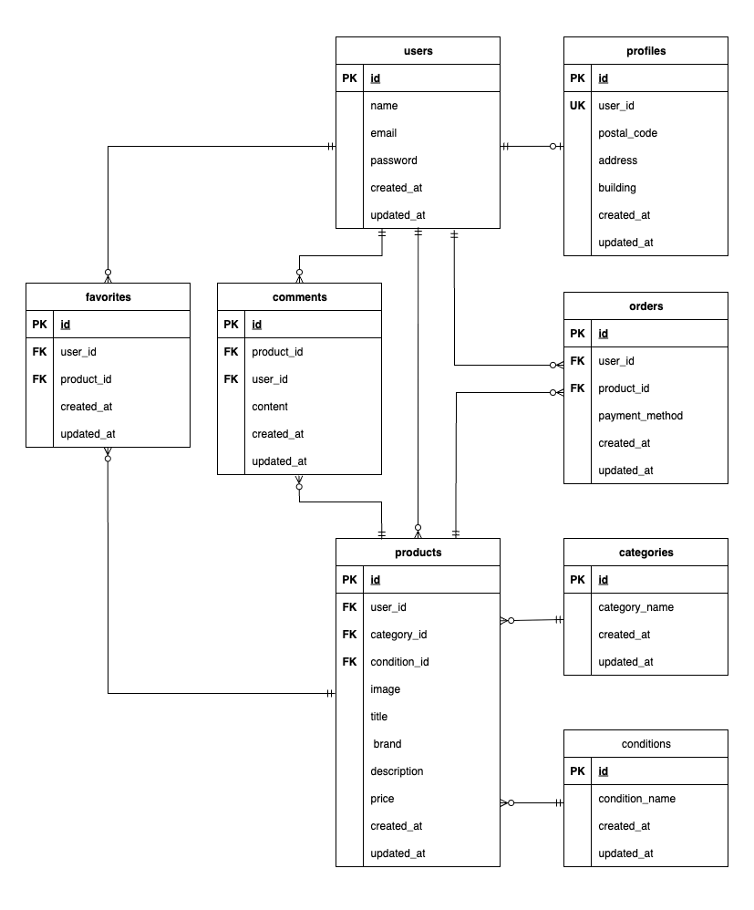

# フリーマーケットアプリ

## 環境構築

**Docker ビルド**

1. `git clone git@github.com:estra-inc/confirmation-test-contact-form.git`
2. DockerDesktop アプリを立ち上げる
3. `docker-compose up -d --build`

> _本プロジェクトでは、**M1/M2 Mac でもビルド可能** になるように `platform: linux/amd64` を指定済みです。_

```bash
# docker-compose.yml
nginx:
    platform: linux/amd64

php:
    platform: linux/amd64

mysql:
platform: linux/amd64

phpmyadmin:
platform: linux/amd64

# Dockerfile
FROM --platform=linux/amd64 php:8.1-fpm
```

**Laravel 環境構築**

1. `docker-compose exec php bash`
2. `composer install`
3. 「.env.example」ファイルを 「.env」ファイルに命名を変更。または、新しく.env ファイルを作成
4. .env に以下の環境変数を追加

```text
DB_CONNECTION=mysql
DB_HOST=mysql
DB_PORT=3306
DB_DATABASE=laravel_db
DB_USERNAME=laravel_user
DB_PASSWORD=laravel_pass
```

5. アプリケーションキーの作成

```bash
php artisan key:generate
```

6. マイグレーションの実行

```bash
php artisan migrate
```

7. シーディングの実行

```bash
php artisan db:seed
```

## 使用技術(実行環境)

- PHP8.3.0
- Laravel8.83.27
- MySQL8.0.26

## ER 図



## URL

- 開発環境：http://localhost/
- phpMyAdmin:：http://localhost:8080/
